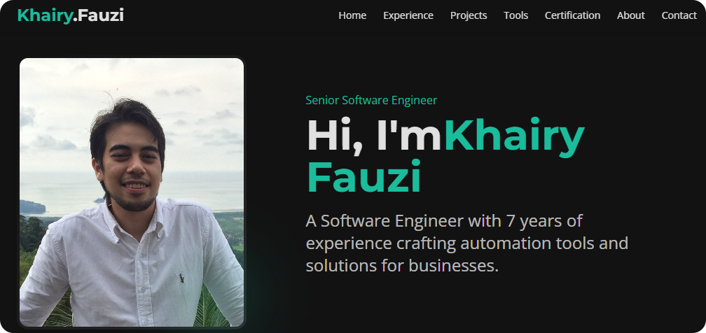

# Khairy Fauzi Portfolio

A clean and modern personal portfolio website for Khairy Fauzi, Software Engineer & UI/UX Designer. This site showcases professional experience, technical projects, certifications, and contact details in a responsive and well-structured layout.

## Project Overview

This portfolio was built to serve as an online presence for potential clients, recruiters, and collaborators. It highlights both development and design skills, featuring selected projects and credentials in a fast, accessible, and aesthetically polished frontend.

## Live Demo

View the live portfolio here:  
<a href="https://www.nexflow.biz" target="_blank">
  <strong></strong>
</a>

## Technologies Used

- Vite  
- React  
- TypeScript  
- Tailwind CSS  
- shadcn/ui  

## Getting Started

### Prerequisites

Ensure you have the following installed:

- Node.js (v16+)
- npm (Node package manager)

### Setup Instructions

```bash
# Clone the repository
git clone https://github.com/yourusername/your-portfolio.git
cd your-portfolio

# Install dependencies
npm install

# Start the development server
npm run dev
```

## Deployment

You can deploy this portfolio to any static hosting provider such as:

- Vercel
- Netlify
- GitHub Pages

Just connect your repository and follow the provider’s deployment instructions.

## Project Structure

```
khairy-fauzi-portfolio/
├── public/             # Static assets
├── src/                # Source code
│   ├── components/     # Reusable UI components
│   ├── pages/          # Page routes (Home, Projects, Contact, etc.)
│   ├── styles/         # Tailwind or custom styles
│   ├── integrations/   # API integrations (e.g., Supabase)
│   └── main.tsx        # App entry point
├── tailwind.config.js  # Tailwind CSS configuration
├── vite.config.ts      # Vite configuration
├── package.json        # Project metadata and dependencies
└── supabase/           # Supabase backend functions/config
```

## Contact

If you'd like to connect, collaborate, or hire:

- Email: khairy.fauzi@gmail.com
- Website: https://www.nexflow.biz  
- LinkedIn: https://linkedin.com/in/khairifauzi

## License

This project is open-source and available under the MIT License.